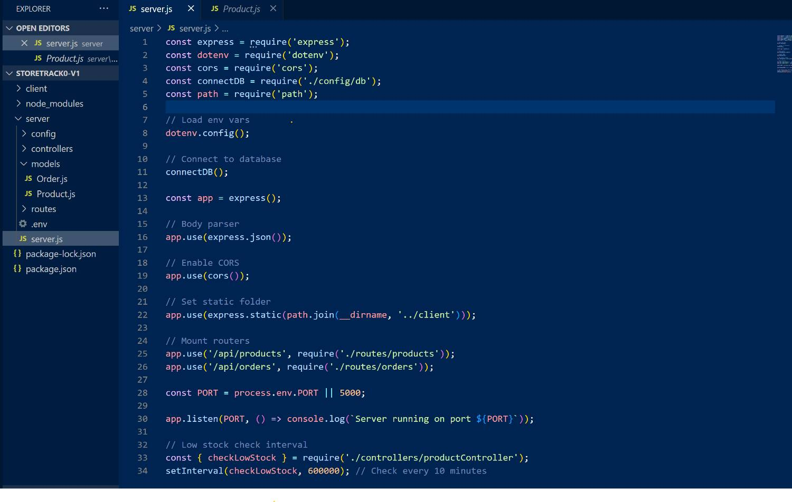
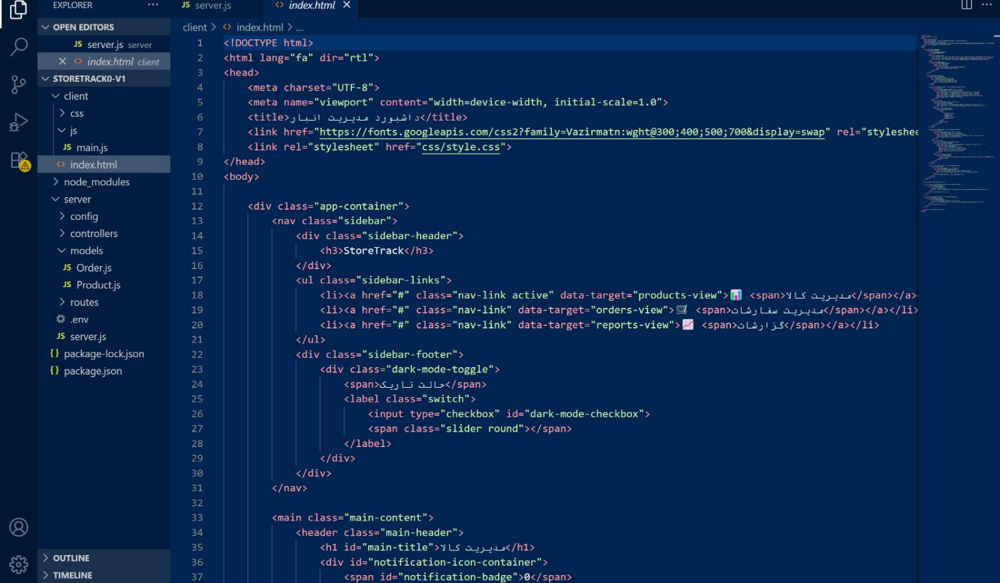

# StoreTrack
Inventory &amp; Order Management System
# StoreTrack - Inventory & Order Management System

StoreTrack is a full-stack web application designed for small businesses to efficiently manage their product inventory, track orders, and gain insights into sales performance. It features a modern, responsive dashboard with a clean user interface and a robust backend to handle all business logic.


## ✨ Features

* **Product Management:** Add new products with details like name, stock, price, and category.
* **Order Management:** Create new orders, which automatically deducts from product stock.
* **Status Tracking:** Update order statuses (Pending, Shipped, Canceled). Canceled orders automatically restock the items.
* **Inventory Control:** Easily increase the stock of existing products.
* **Detailed History:** View a complete history of stock changes (in/out) for every product in a clean modal view.
* **Advanced Filtering & Searching:** Dynamically search and filter both products and orders based on multiple criteria (name, category, status, etc.).
* **Insightful Reports:** Generate reports for daily sales (with itemized details) and view products that are running low on stock.
* **Smart Notification System:**
    * Receive a temporary pop-up alert for low-stock items.
    * A persistent notification center (bell icon) logs all alerts.
    * A badge on the bell icon indicates the number of unread notifications.
* **Modern User Interface:**
    * A fully responsive design that works on desktop, tablet, and mobile.
    * A sleek **Dark Mode** feature with user preference saved in local storage.
    * A clean, icon-based sidebar for easy navigation.

---

## 🛠️ Tech Stack

* **Backend:**
    * **Node.js:** JavaScript runtime environment.
    * **Express.js:** Web framework for building the API.
    * **MongoDB:** NoSQL database for data persistence.
    * **Mongoose:** Object Data Modeling (ODM) library for MongoDB.
* **Frontend:**
    * **HTML5:** Standard markup language.
    * **CSS3:** Styling with modern features like Flexbox, Grid, and CSS Variables.
    * **Vanilla JavaScript (ES6+):** For all client-side logic, DOM manipulation, and API interaction.

---

## 📋 Prerequisites

Before you begin, ensure you have the following installed on your system:
* [Node.js](https://nodejs.org/en/) (v18.x or later recommended)
* [MongoDB](https://www.mongodb.com/try/download/community) (or access to a MongoDB Atlas cluster)
* A code editor like [Visual Studio Code](https://code.visualstudio.com/)
* A modern web browser like Chrome or Firefox

---

## 🚀 Installation & Setup

Follow these steps to get the project up and running on your local machine.

1.  **Clone the Repository**
    If you have Git installed, you can clone the repository. Otherwise, download and extract the project files.
    ```bash
    git clone [https://your-repository-url.git](https://your-repository-url.git)
    cd inventory-management
    ```

2.  **Configure Environment Variables**
    Navigate to the `server` directory and create a new file named `.env`.
    ```bash
    cd server
    touch .env
    ```
    Open the `.env` file and add the following configuration. Replace the MongoDB URI if you are using a cloud instance.
    ```env
    MONGO_URI=mongodb://localhost:27017/StoreTrackDB
    PORT=5000
    ```

3.  **Install Dependencies**
    While still in the `server` directory, install the required Node.js packages.
    ```bash
    npm install
    ```

---

## 🏃 Running the Application

1.  **Start Your MongoDB Server**
    Make sure your local MongoDB service is running.

2.  **Start the Backend Server**
    Navigate to the `server` directory (if you're not already there) and run:
    ```bash
    node server.js
    ```
    You should see the following output in your terminal, confirming the server is running and connected to the database:
    ```
    Server running on port 5000
    MongoDB Connected...
    ```

3.  **Access the Frontend**
    The Node.js server is configured to serve the client files. Open your web browser and navigate to:
    **http://localhost:5000**

You should now see the StoreTrack dashboard and can begin using the application.

---

## 📁 Project Structure

```
inventory-management/
├── server/
│   ├── config/
│   │   └── db.js               # MongoDB connection logic
│   ├── controllers/
│   │   ├── productController.js  # Logic for product operations
│   │   └── orderController.js    # Logic for order operations
│   ├── models/
│   │   ├── Product.js          # Product data schema
│   │   └── Order.js            # Order data schema
│   ├── routes/
│   │   ├── products.js         # API routes for products
│   │   └── orders.js           # API routes for orders
│   ├── .env                    # Environment variables (you create this)
│   └── server.js               # Main Express server file
├── client/
│   ├── css/
│   │   └── style.css           # All styles for the frontend
│   ├── js/
│   │   └── main.js             # All client-side JavaScript logic
│   └── index.html              # The single HTML page for the application
├── .gitignore
└── README.md                   # This file
```

##  Project Screenshuts



# 📌 GitHub link

[مشاهده پروژه در GitHub](https://github.com/AzinGhanavati/StoreTrack#)